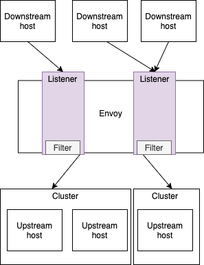

# CF for K8s networking

## Logical Network Traffic


| Artefact                                                                                                            | Description                                                                     |
| ------------------------------------------------------------------------------------------------------------------- | ------------------------------------------------------------------------------- |
| Client                                                                                                              | A client which would like to talk to the application                            |
| [Service(LoadBalancer)](https://kubernetes.io/docs/tasks/access-application-cluster/create-external-load-balancer/) | External Load Balancer                                                          |
| [Gateway](https://istio.io/docs/reference/config/networking/gateway/)                                               |                                                                                 |
| [Virtual Service](https://istio.io/docs/reference/config/networking/virtual-service/)                               | How you route your traffic to a given destination. Refers to kubernetes service |
| [App Service](https://kubernetes.io/docs/concepts/services-networking/service/)                                     | Kubernetes service, which is used to route the traffic to the application pod   |
| app                                                                                                                 | The application itself                                                          |

## Physical Network Traffic


| Artefact                                                                                                                                                                                         | Description                                                                                                                                                                                                                                                                                                                                                                                                                                                                                                                                                                                                            |
| ------------------------------------------------------------------------------------------------------------------------------------------------------------------------------------------------ | ---------------------------------------------------------------------------------------------------------------------------------------------------------------------------------------------------------------------------------------------------------------------------------------------------------------------------------------------------------------------------------------------------------------------------------------------------------------------------------------------------------------------------------------------------------------------------------------------------------------------- |
| Client | A client which would like to talk to the application|
| Developer | The developer deploys the application to Cloud Foundry using `cf push`. During this action the Cloud controller builds the application and deploys it to kubernetes. Additionally the Cloud Controller creates a `Route CR`.|
| [Service(LoadBalancer)](https://kubernetes.io/docs/tasks/access-application-cluster/create-external-load-balancer/)                                                                              | Exposes the Service externally using a cloud provider’s load balancer. <br/>[An example configuration](examples/service-istio-ingressgateway.yaml)                                                                                                                                                                                                                                                                                                                                                                                                                                                       |
| [IngressGateway](https://istio.io/docs/reference/config/networking/gateway/)                                                                                                                     | The `IngressGateway`, is responsible to route the network traffic to different locations like system services of applications. Istio is using [Envoy](https://www.envoyproxy.io/) for this purpose. Envoy is configured by Pilot(see below). In cf-for-k8s, only `VirtualServices` are used to configure the routes. For details see Routes below. The `IngressGateway` is implemented as [`DaemonSet`](https://istio.io/docs/reference/config/networking/gateway/). A `DaemonSet` ensures that all Nodes run a copy of this gateway.<br/>[An example configuration](examples/istio-ingressgateway.yaml)  |
| [Pilot](https://istio.io/docs/ops/deployment/architecture/#pilot)                                                                                                                                | Pilot converts high level routing rules (e.g. `Gateways` or `VirtualServices`) that control traffic behavior into Envoy-specific configurations, and propagates them to the sidecars at runtime. |
| [App Service](https://kubernetes.io/docs/concepts/services-networking/service/)  | Kubernetes service, which is used to route the traffic to the application pod|
| Application | This is the application, which is deployed by the developer and used by the client. The inbound traffic is routed through the Envoy, which is running in a sidecar.
| [Sidecar](https://istio.io/docs/reference/config/networking/sidecar/) | Every instance(replica) of an app has a sidecar Envoy, which runs in parallel with the app. These Envoys monitors everything about the application.|
| [Cloud Controller](https://docs.cloudfoundry.org/concepts/architecture/cloud-controller.html)| The Cloud Controller in Cloud Foundry (CF) provides REST API endpoints for clients (developers) to access the system.|
| RouteController && Route CR [WIP] | The Architecture Decision to use `Route CRD` and `RouteController` can be found [here](https://github.com/cloudfoundry/cf-k8s-networking/blob/master/doc/architecture-decisions/0010-route-crd-and-kubebuilder-instead-of-metacontroller.md). According to the [CF4k8s Networking - Route CRD Proposal](https://docs.google.com/document/d/1DF7eTBut1I74w_sVaQ4eeF74iQes1nG3iUv7iJ7E35U/) RouteController watches for updates to the `Route CR` and translates these into `Kubernetes Service` and `Istio VirtualService` objects.|
| [Gateway](https://istio.io/docs/reference/config/networking/gateway/) | Cloud Foundry uses one single `Gateway` to route the network traffic.|
| [Virtual Service for System Services](https://istio.io/docs/reference/config/networking/virtual-service/) | During installation a `VirtualService` is created for each system service: <ul><li>Cloud Controller `api.cf...`</li><li>Log Cache `log-cache.cf...`</li><li>UAA `uaa.cf...`, `*.uaa.cf...`, `login.cf...`, `*.login.cf...` </li></ul>|
|  [Virtual Service for Applications](https://istio.io/docs/reference/config/networking/virtual-service/)| For each application a `VirtualService` is created. <br/>[An example configuration](examples/app-virtualservice.yaml). <br/>This `VirtualService` is also responsible to add the required HTTP headers (e.g. `CF-App-Id`). Each `VirtualService` refers to a kubernetes service. [`DestinationRules`](https://istio.io/docs/concepts/traffic-management/#destination-rules) are also part of Istio traffic management. Using destination rules you can configure what happens to traffic for that destination (e.g. traffic policy). <br/>*NOTE:* Envoy first evaluates route rules in virtual services to determine if a particular subset is being routed to. If so, only then will it activate any destination rule policies corresponding to the subset. Consequently, Istio only applies the policies you define for specific subsets in destination rules if you explicitly routed traffic to the corresponding subset. |


## Envoy

The envoyproxy documentation contains a subpage where the basic terminology (listener, upstream, downstream, cluster, ...) of envoy is explained: https://www.envoyproxy.io/docs/envoy/latest/intro/arch_overview/intro/terminology



| Artefact                                                                                                                                                                                         | Description                                                                                                                                                                                                                                                                                                                                                                                                                                                                                                                                                                                                            |
| ------------------------------------------------------------------------------------------------------------------------------------------------------------------------------------------------ | ---------------------------------------------------------------------------------------------------------------------------------------------------------------------------------------------------------------------------------------------------------------------------------------------------------------------------------------------------------------------------------------------------------------------------------------------------------------------------------------------------------------------------------------------------------------------------------------------------------------------- |
| Downstream Host | A client connecting to Envoy in order to reach a backend app / service|
| Upstream Cluster | A backend app / service that requests are forwarded to by Envoy using load balancing|
| Listener | A frontend exposed by Envoy that allows downstream hosts to connect. Think 0.0.0.0:443|
| Filter | Pluggable logic that allows traffic manipulation and routing decisions to upstream clusters|

### Log levels

It is possible to increase/set envoy's log level via
`curl -X POST -s http://localhost:15000/logging?level=debug`. It is also possible to increase the log level for individual loggers. Possible log levels are critical, error, warning, info, debug, trace.

### Configuration
Envoy Ingress [config](examples/initial/ingress.json) contains:
- clusters
  - static clusters (for statistics e.g. prometheus)
  - cluster
    - type
    - service_name
    - circuit breaking (Envoy enforces these limits at network level)
    - transport_socket (for tls context)
- listeners
- routes
- secrets

The istio documentation has some information on how-to retrieve the current configuration of the sidecar and ingress envoys in a cluster using the `istioctl` https://istio.io/docs/ops/diagnostic-tools/proxy-cmd/. It is also possible to directly use envoy's [admin endpoint](https://www.envoyproxy.io/docs/envoy/latest/operations/admin) on port 15000. For example, dump config via a GET on `/config_dump` or examine endpoints via a GET on `/clusters?format=json`.

In the istio case other envoy proxy runs on the same node (as sidecar container) as the app on the upstream host.


### Istiod architecture changes
Current (v1.4) implementation features 3 components:
- pilot
- mixer
- citadel

https://archive.istio.io/v1.4/docs/concepts/security/architecture.svg

The upcoming architecture will merge them into a single istiod component:

https://istio.io/docs/concepts/security/arch-sec.svg

## CloudFoundry, Istio and Envoy Config Diffs
This section describes what happens during common cf push and map-route use-cases.
For this purpose, a single app `test-app-a` is pushed, then another app `test-app-b`.
Finally, an additional route is mapped to `test-app-b` and the effects on CF, istio and envoy layers are documented.

### Push Single App
CF:

1. A new CR of kind "Route" gets created: `/apis/networking.cloudfoundry.org/v1alpha1/namespaces/cf-workloads/routes/<UUID>`
1. The spec contains the new route information:
```
spec:
  destinations:
  - app:
      guid: 292c7ae2-8d4c-449c-bd56-ec40ca644d57
      process:
        type: web
    guid: 7afcae7d-d2ff-4310-9e74-2ec9ca4cca19
    port: 8080
    selector:
      matchLabels:
        cloudfoundry.org/app_guid: 292c7ae2-8d4c-449c-bd56-ec40ca644d57
        cloudfoundry.org/process_type: web
  domain:
    internal: false
    name: cf.cf4k8s.istio.shoot.canary.k8s-hana.ondemand.com
  host: test-app-a
  path: ""
  url: test-app-a.cf.cf4k8s.istio.shoot.canary.k8s-hana.ondemand.com
```

Istio:

1. A new VirtualService gets created: `/apis/networking.istio.io/v1alpha3/namespaces/cf-workloads/virtualservices/vs-<unique name>`
1. The spec contains the public DNS name of the app, the service name to which traffic will be routed as well as HTTP headers to set.
```yaml
 spec:
    gateways:
    - cf-system/istio-ingressgateway
    hosts:
    - test-app-b.cf.cf4k8s.istio.shoot.canary.k8s-hana.ondemand.com
    http:
    - route:
      - destination:
          host: s-833a86e8-414f-4ac7-882b-6bc0c3c40366
        headers:
          request:
            set:
              CF-App-Id: 673ab4f3-101c-41a6-b1e3-aca13da1dd45
              CF-App-Process-Type: web
              CF-Organization-Id: e9aab7d8-298f-4aa7-9a77-46a721a36197
              CF-Space-Id: e7bb5fa9-9496-4179-b244-806b268a8c64
          response: {}
```

Ingress Envoy:

1. Envoy will pick up ingress spec from istio to map a host name to a service name
1. A new cluster entry is added to the ingress envoy config. (Don't confuse cluster with kubernetes cluster - it's an envoy backend)
   The cluster entry contains info needed for the ingress envoy to open a TLS session with the app sidecar envoy
```json
            "name": "outbound|8080||s-833a86e8-414f-4ac7-882b-6bc0c3c40366.cf-workloads.svc.cluster.local",
            "transport_socket_matches": [
              {
                "match": {
                  "tlsMode": "istio"
                },
                "name": "tlsMode-istio",
                "transport_socket": {
                  "name": "tls",
                  "typed_config": {
                    "@type": "type.googleapis.com/envoy.api.v2.auth.UpstreamTlsContext",
                    "common_tls_context": {
                      "alpn_protocols": [
                        "istio"
                      ],
                      "tls_certificates": [
                        {
                          "certificate_chain": {
                            "filename": "/etc/certs/cert-chain.pem"
                          },
                          "private_key": {
                            "filename": "/etc/certs/key.pem"
                          }
                        }
                      ],
                      "validation_context": {
                        "trusted_ca": {
                          "filename": "/etc/certs/root-cert.pem"
                        },
                        "verify_subject_alt_name": [
                          "spiffe://cluster.local/ns/cf-workloads/sa/eirini-privileged"
                        ]
                      }
                    },
                    "sni": "outbound_.8080_._.s-833a86e8-414f-4ac7-882b-6bc0c3c40366.cf-workloads.svc.cluster.local"
                  }
                }
              },
```
1. A listener is added for the mapped app host name for both http and https variants.
   The listener translates the virtual service configuration into envoy configuration. #TODO: check what listener looks like
   A route entry is added so that the ingress envoy knows how a host name is mapped to a service name.
   Request headers are added that will be forwarded to the cf app.
```json
              {
                "domains": [
                  "test-app-b.cf.cf4k8s.istio.shoot.canary.k8s-hana.ondemand.com",
                  "test-app-b.cf.cf4k8s.istio.shoot.canary.k8s-hana.ondemand.com:80"
                ],
                "name": "test-app-b.cf.cf4k8s.istio.shoot.canary.k8s-hana.ondemand.com:80",
                "routes": [
                  {
                    "decorator": {
                      "operation": "s-833a86e8-414f-4ac7-882b-6bc0c3c40366.cf-workloads.svc.cluster.local:8080/*"
                    },
                    "match": {
                      "prefix": "/"
                    },
                    "metadata": {
                      "filter_metadata": {
                        "istio": {
                          "config": "/apis/networking/v1alpha3/namespaces/cf-workloads/virtual-service/vs-655ad2c2a8644d313a4105e611888b8b9b1762e579a2719e26827f5d9c1887ab"
                        }
                      }
                    },
                    "request_headers_to_add": [
                      {
                        "append": false,
                        "header": {
                          "key": "CF-App-Id",
                          "value": "673ab4f3-101c-41a6-b1e3-aca13da1dd45"
                        }
                      },
                      {
                        "append": false,
                        "header": {
                          "key": "CF-App-Process-Type",
                          "value": "web"
                        }
                      },
                      {
                        "append": false,
                        "header": {
                          "key": "CF-Organization-Id",
                          "value": "e9aab7d8-298f-4aa7-9a77-46a721a36197"
                        }
                      },
                      {
                        "append": false,
                        "header": {
                          "key": "CF-Space-Id",
                          "value": "e7bb5fa9-9496-4179-b244-806b268a8c64"
                        }
                      }
                    ],
                    "route": {
                      "cluster": "outbound|8080||s-833a86e8-414f-4ac7-882b-6bc0c3c40366.cf-workloads.svc.cluster.local",
                      "max_grpc_timeout": "0s",
                      "retry_policy": {
                        "host_selection_retry_max_attempts": "5",
                        "num_retries": 2,
                        "retriable_status_codes": [
                          503
                        ],
                        "retry_host_predicate": [
                          {
                            "name": "envoy.retry_host_predicates.previous_hosts"
                          }
                        ],
                        "retry_on": "connect-failure,refused-stream,unavailable,cancelled,resource-exhausted,retriable-status-codes"
                      },
                      "timeout": "0s"
                    },
                    (...)
                  }
                ]
              },
```

App Sidecar Envoy

1. When the sidecar gets injected, iptables rules are added that will capture all inbound traffic and forward it to 0.0.0.0:15006
1. Another rule captures all outbound traffic and forwards it to 0.0.0.0:15001
1. Envoy is started with uid and gid 1337 and an iptables rule is established that skips traffic capture for that user. This way an endless loop
is prevented.

```bash
-A PREROUTING -p tcp -j ISTIO_INBOUND                             # Capture all inbound traffic to istio_inbound chain
-A OUTPUT -p tcp -j ISTIO_OUTPUT                                  # Capture all outbound traffic to istio_outbound chain
-A ISTIO_INBOUND -p tcp -m tcp --dport 22 -j RETURN               # Envoy does not capture SSH connections
-A ISTIO_INBOUND -p tcp -m tcp --dport 15020 -j RETURN            # Exception for prometheus telemetry
-A ISTIO_INBOUND -p tcp -j ISTIO_IN_REDIRECT                      # All other inbound traffic gets redirected to envoy
-A ISTIO_IN_REDIRECT -p tcp -j REDIRECT --to-ports 15006          # Envoy receives incoming traffic on port 15006
-A ISTIO_OUTPUT -s 127.0.0.6/32 -o lo -j RETURN                   # Don't capture from 6 is the magical number for inbound: 15006, 127.0.0.6, ::6
-A ISTIO_OUTPUT ! -d 127.0.0.1/32 -o lo -j ISTIO_IN_REDIRECT      # But do capture non-local outbound connections from loopback
-A ISTIO_OUTPUT -m owner --uid-owner 1337 -j RETURN               # Exception for envoy itself...
-A ISTIO_OUTPUT -m owner --gid-owner 1337 -j RETURN               # ... this will prevent envoy from capturing its own traffic
-A ISTIO_OUTPUT -d 127.0.0.1/32 -j RETURN                         # Don't capture connections to localhost (RETURN = leave chain)
-A ISTIO_OUTPUT -j ISTIO_REDIRECT                                 # All other outbound traffic gets redirected to envoy
-A ISTIO_REDIRECT -p tcp -j REDIRECT --to-ports 15001             # Envoy receives outgoing traffic on port 15001
```

1. When a new kubernetes service is added (i.e. cluster ip for CF app), no changes are made to envoy config by default.
1. The started sidecar envoy gets pre-configured listeners as described below.

See https://istio.io/docs/ops/deployment/requirements/#ports-used-by-istio for list of special envoy ports.
Use https://archive.istio.io/v1.4/docs/ops/diagnostic-tools/proxy-cmd/ for actual debugging advice.

A virtual listener on 0.0.0.0 per each HTTP port for outbound HTTP traffic (e.g. configured via VirtualService).
A virtual listener per service IP, per each non-HTTP for outbound TCP/HTTPS traffic.
E.g., in the table below, there are two entries for port `8080`. In order to distinguish HTTP and non-HTTP traffic, there is an additional virtual listener with the IP `10.68.227.69` in place.

```bash
$ istioctl proxy-config listener  test-app-a-test-eb94aee321-0.cf-workloads
ADDRESS          PORT      TYPE
0.0.0.0          15001     TCP    # outbound envoy port
0.0.0.0          15006     TCP    # inbound envoy port
10.68.227.69     8080      TCP    # Outbound HTTPS/TCP traffic to metric-proxy.cf-system service
10.66.218.25     8085      TCP    # Outbound HTTPS/TCP traffic to eirini.cf-system service
10.68.94.164     24224     TCP    # Outbound HTTPS/TCP traffic to fluentd-forwarder-ingress.cf-system service
10.66.80.251     8082      TCP    # Outbound HTTPS/TCP traffic to log-cache-syslog.cf-system service
0.0.0.0          8080      TCP    # Outbound HTTP traffic to uaa.cf-system
0.0.0.0          80        TCP    # Outbound HTTP traffic to capi.cf-system and cfroutesync.cf-system
0.0.0.0          8083      TCP    # Outbound HTTP traffic to log-cache.cf-system service. Check below for detailed config
0.0.0.0          15090     HTTP   # Envoy Prometheus telemetry
10.96.4.62       15020     TCP    # deprecated (https://github.com/istio/istio/issues/24147)
10.96.4.62       8080      HTTP   # deprecated (https://github.com/istio/istio/issues/24147)
```

**CAVEAT**: The additional listeners besides outbound and inbound envoy capture ports are obsolete and will not be used for routing. They will be removed in Istio 1.6. See [this issue](https://github.com/istio/istio/issues/24147) for details.

**NOTE:** For a deep-dive into how the sidecar pattern works in istio, check out [Jimmy Song's blog post](https://jimmysong.io/en/blog/sidecar-injection-iptables-and-traffic-routing/) which also features a great [routing workflow diagram](https://jimmysong.io/en/blog/sidecar-injection-iptables-and-traffic-routing/envoy-sidecar-traffic-interception-jimmysong-blog-en.png) that shows exactly how the traffic is routed.

#### How traffic is forwarded from sidecar to app container

The `istio-init` initContainer configures IP tables in such a way that all incoming traffic is routed to port 15006. Then, there is a listener on port 15006 which has a listener filter `envoy.listener.original_dst` which restores the original destination address before filter chains apply. Then there is a list of filter chains which match in order of most to least specific destination, i.e. `100.96.4.29/32` is more specific than `0.0.0.0/0` so the higher prefix length wins.

`istioctl proxy-config listener  test-app-a-test-eb94aee321-0.cf-workloads --port 15006 -o json`
```yaml
        {
          "listener": {
            "address": {
              "socket_address": {
                "address": "0.0.0.0",
                "port_value": 15006       # all inbound traffic gets forwarded here
              }
            },
            "continue_on_listener_filters_timeout": true,
            "filter_chains": [
              {
                "filter_chain_match": {
                  "prefix_ranges": [
                    {
                      "address_prefix": "0.0.0.0",
                      "prefix_len": 0
                    }
                  ]
                },
                "filters": [
                  {
                    "name": "envoy.tcp_proxy",
                    "typed_config": {
                      "@type": "type.googleapis.com/envoy.config.filter.network.tcp_proxy.v2.TcpProxy",
                      "access_log": [ (...) ],
                      "cluster": "InboundPassthroughClusterIpv4",
                      "stat_prefix": "InboundPassthroughClusterIpv4"
                    }
                  }
                ],
                (...)
              },
              { # (other filter chains here)
               (...)
              },
              {
                "filter_chain_match": {
                  "destination_port": 8080,
                  "prefix_ranges": [
                    {
                      "address_prefix": "100.96.4.29",    # this matches the app's pod ip and app port 8080
                      "prefix_len": 32
                    }
                  ]
                },
                "filters": [
                  {
                    "name": "envoy.http_connection_manager",
                    "typed_config": {
                      "@type": "type.googleapis.com/envoy.config.filter.network.http_connection_manager.v2.HttpConnectionManager",
                      "access_log": [ (...) ],
                      "forward_client_cert_details": "APPEND_FORWARD",
                      "generate_request_id": true,
                      "http_filters": [ (...) ],
                      "normalize_path": true,
                      "route_config": {
                        "name": "inbound|8080|http|s-7afcae7d-d2ff-4310-9e74-2ec9ca4cca19.cf-workloads.svc.cluster.local",
                        "validate_clusters": false,
                        "virtual_hosts": [
                          {
                            "domains": [
                              "*"
                            ],
                            "name": "inbound|http|8080",
                            "routes": [
                              {
                                "decorator": {
                                  "operation": "s-7afcae7d-d2ff-4310-9e74-2ec9ca4cca19.cf-workloads.svc.cluster.local:8080/*"
                                },
                                "match": {
                                  "prefix": "/"
                                },
                                "name": "default",
                                "route": {    # this route selects the cluster backend for inbound app traffic
                                  "cluster": "inbound|8080|http|s-7afcae7d-d2ff-4310-9e74-2ec9ca4cca19.cf-workloads.svc.cluster.local",
                                  "max_grpc_timeout": "0s",
                                  "timeout": "0s"
                                },
                                "typed_per_filter_config": { ... }

(...)
              "listener_filters": [
              {
                "name": "envoy.listener.original_dst"     # this restores original destination before filter chains are run
              },
              {
                "name": "envoy.listener.tls_inspector"
              }
            ],
            "listener_filters_timeout": "1s",
            "name": "virtualInbound"
          },

```
Since incoming traffic has our podIP `100.96.4.29` as dstIP and dstPort `8080` the first and the last filter chain match and the last filter chain wins, because it matches the port. This filter chain has a matching virtualHost `inbound|http|8080` (domain `*` matches all) and therefore the packet is using route `default` to cluster `inbound|8080|http|s-ef9c974d-adfd-4552-8fcd-19e17f84d8dc.cf-workloads.svc.cluster.local`.

`$ istioctl proxy-config cluster test-app-a-test-eb94aee321-0.cf-workloads --fqdn "inbound|8080|http|s-ef9c974d-adfd-4552-8fcd-19e17f84d8dc.cf-workloads.svc.cluster.local"  -o json`
```yaml
[
    {
        "name": "inbound|8080|http|s-ef9c974d-adfd-4552-8fcd-19e17f84d8dc.cf-workloads.svc.cluster.local",
        "type": "STATIC",
        "loadAssignment": {
            "clusterName": "inbound|8080|http|s-ef9c974d-adfd-4552-8fcd-19e17f84d8dc.cf-workloads.svc.cluster.local",
            "endpoints": [
                {
                    "lbEndpoints": [
                        {
                            "endpoint": {
                                "address": {
                                    "socketAddress": {
                                        "address": "127.0.0.1",
                                        "portValue": 8080
```
This cluster has one static endpoint configured and that is localhost:8080, which is where our application is listening.


### How egress is forwarded from the app container

In contrast to bosh-deployed CF, there is no NAT gateway in cf-for-k8s. Instead, k8s handles NAT. Gardener-managed K8s clusters have private node IPs and create NAT gateways to perform address translation. How these gateways are implemented depends on the respective infrastructure provider, e.g. the [`Cloud NAT Gateway`](https://cloud.google.com/nat/docs/overview) on GCP is purely software-defined. Since there is no Istio egress-gateway in cf-for-k8s as well, egress traffic from an app is routed through the sidecar and then to its destination outside the cluster using the infrastructure-specific NAT solution.


#### Envoy configuration

The `istio-init` init container configures IP tables in such a way that all outgoing traffic is routed to port `15001`. There is a listener on this port that has `useOriginalDst` set to true which means it hands the request over to the listener that best matches the original destination of the request. If it can’t find any matching virtual listeners it sends the request to the `PassthroughCluster` which connects to the destination directly. For any address, where there is no special Istio config, e.g. for google.com:443, the `PassthroughCluster` is used.

`istioctl proxy-config listener  test-app-a-test-eb94aee321-0.cf-workloads --port 15001 -o json`
```yaml
[
    {
        "name": "virtualOutbound",
        "address": {
            "socketAddress": {
                "address": "0.0.0.0",
                "portValue": 15001
            }
        },
        "useOriginalDst": true
    }
]
```

There is a virtual listener on 0.0.0.0 per each HTTP port for outbound HTTP traffic. We follow the packet sent to the log-cache-service via `curl log-cache.cf-system:8083/test`.

```bash
$ istioctl proxy-config listener test-app-a-test-eb94aee321-0.cf-workloads --port 8083 -o json
...
"filters": [
      {
          "name": "envoy.http_connection_manager",
          "typedConfig": {
              "rds": {
                  "configSource": {
                      "ads": {}
                  },
                  "routeConfigName": "8083"
              },
...
```
The filter above belongs to the matching listener. `rds` means Route Discovery Service which looks for a route config with name `8083`.

```bash
$ istioctl proxy-config routes  test-app-a-test-eb94aee321-0.cf-workloads --name 8083 -o json
[
    {
        "name": "8083",
        "virtualHosts": [
            {
                "name": "log-cache.cf-system.svc.cluster.local:8083",
                "domains": [
                    "log-cache.cf-system.svc.cluster.local",
                    "log-cache.cf-system.svc.cluster.local:8083",
                    "log-cache.cf-system",
                    "log-cache.cf-system:8083",
                    "log-cache.cf-system.svc.cluster",
                    "log-cache.cf-system.svc.cluster:8083",
                    "log-cache.cf-system.svc",
                    "log-cache.cf-system.svc:8083",
                    "10.69.103.199",
                    "10.69.103.199:8083"
                ],
                "routes": [
                    {
                        "name": "default",
                        "match": {
                            "prefix": "/"
                        },
                        "route": {
                            "cluster": "outbound|8083||log-cache.cf-system.svc.cluster.local",
```

In the route config, the virtual host with name "8083" matches our domain "log-cache.cf-system:8083". In this virtual host, the route with name "default" matches our path "/test" and the "outbound|8083||log-cache.cf-system.svc.cluster.local" is selected.

```bash
$ istioctl proxy-config cluster test-app-a-test-eb94aee321-0.cf-workloads --fqdn log-cache.cf-system.svc.cluster.local -o json
...
"dynamic_active_clusters": [
    {
      "cluster": {
        ...
        "edsClusterConfig": {
              "edsConfig": {
                  "ads": {}
              },
              "serviceName": "outbound|8083||log-cache.cf-system.svc.cluster.local"
          },
      ...
```

The cluster "outbound|8083||log-cache.cf-system.svc.cluster.local" gets its endpoints from Pilot via Aggregated Discovery Service (ADS). These endpoints consist of a port and the targeted `pod IP` (in this case the pod IP of cf-system/log-cache-7bd48bbfc7-8ljxv).

*Note:* The list of endpoints is not dumped at `localhost:15000/config_dump`. Use istioctl or `curl -s http://localhost:15000/clusters?format=json` to get it.

```bash
$ istioctl proxy-config endpoints test-app-a-test-eb94aee321-0.cf-workloads --cluster "outbound|8083||log-cache.cf-system.svc.cluster.local"
ENDPOINT             STATUS      OUTLIER CHECK     CLUSTER
10.96.0.159:8083     HEALTHY     OK                outbound|8083||log-cache.cf-system.svc.cluster.local
```

The picture illustrates the described above config.


## Traffic restrictions

There are two `Sidecar` resources deployed by cf-for-k8s.
* There is one default Sidecar in the `istio-system` namespace that allows all traffic. This Sidecar is used as the default for all namespaces without a Sidecar.
* There is a Sidecar resource in the `cf-workload` namespace that restricts egress traffic to other services in the mesh. Only services in the `cf-system` namespace can be reached. Note that this does not affect domains outside the mesh, e.g. google.de.
```yaml
kind: Sidecar
metadata:  #...
  name: default
  namespace: cf-workloads
spec:
  egress:
  - hosts:
    - cf-system/*
```


### Egress

Egress traffic from an app is always routed via the sidecar. For a more detailed explanation, see Section [How egress is forwarded from the app container](https://github.com/akhinos/cf4k8s-networking#how-egress-is-forwarded-from-the-app-container). In general, Istio is configured to allow arbitrary egress, therefore apps have access to the internet.  


### Push Another App

No changes to envoy config of existing app(s). No direct app-to-app communication is possible as of now.


### Map Additional Route


## Debugging

### Looking into the TCP layer

**ksniff**

[ksniff](https://github.com/eldadru/ksniff) is a tool that injects a statically linked tcpdump binary into a running pod. It allows to
tap into the pod traffic directly and streams the live capture into a local wireshark. Alternatively it can dump tpc traffic into a pcap file.

When using ksniff on CF apps you will stumble over the issue that CF pods are non-privileged. Therefore, the injected tcpdump will not be able to capture any traffic.

A workaround to this is running ksniff with the `-p` option. This will start a second (privileged) pod that will access the underlying docker daemon:

```
cf apps
Getting apps in org testorg / space test as admin...
OK

name         requested state   instances   memory   disk   urls
helloworld   started           1/1         1G       1G     helloworld.cf.cf4k8s.istio.shoot.canary.k8s-hana.ondemand.com

kubectl get pods -n cf-workloads
NAME                           READY   STATUS            RESTARTS   AGE
helloworld-test-8badcc3ee4-0   2/2     Running           0          8m46s


./kubectl-sniff-darwin helloworld-test-8badcc3ee4-0 -p -n cf-workloads
```

This will launch a local wireshark where you can trace the TCP traffic of the target pod.

Test your app:
```
curl https://helloworld.cf.cf4k8s.istio.shoot.canary.k8s-hana.ondemand.com
Hello World
```

Find your packet on wireshark:


**CAVEAT:** Running ksniff in privileged mode will require additional resources as a new pod is started. This can be an issue if the supporting node
is near out of resources.

* Looking at k8s networking (in particular when traffic gets routed to another worker node?
* Looking at the traffic passing through Envoys

### Open Questions

* Istio `istio-system/ingressgateway` is not used.
